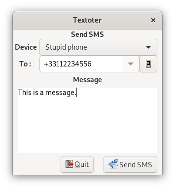

textoter
========
Textoter is a simple application that sends SMS using a phone connected /via/ Bluetooth.
It is written as an alternative to the phone's proprietary interface.

Features
========
* Use Bluetooth
* Import the phone's contacts
* Contact completion

Installing Textoter
===================
Dependencies
------------
Textoter is a Gnome application, written in Python. It uses bluez stack /via/ DBus. The contacts are parsed using `vobject`.
To detect phone capabilities, textoter uses `sdptool` from `bluez` package.

Install
-------
To install from command line:

    pip install textoter

User interface
==============
To be detected by Textoter, your phone should have been connected at least one time with the computer using the [GNOME's Bluetooth interface](https://help.gnome.org/users/gnome-help/stable/bluetooth-connect-device.html.en).

Starting Textoter
-----------------
From command line launch Textoter with:

    textoter

Phone selection
--------------
On startup Textoter detects the available phones and list them in `Devices`.
Select the phone from this drop-down list.

Recipient
---------
To define the recipient, either:
* type directly the phone number in the `To :` field, preferrably in international format `+123456789`
* Use phone's contacts

For the latter:
* load the phone contacts by clicking on the `phone` icon-button. Depending on your phone settigs, you may have to confirm that the computer can access phone's contacts.
* select in the drop-down list the contact. You can also type the contact name and Textoter will propose a list of possible completions.

Message
-------
Type the message in the text area under `Message`.

Send
----
Click on the `Send` button. Textoter then transmit the message to the phone. Depending on your phone, you will have to confirm that the computer can access phone messages.

Quit
----
Click on `Quit` button. Textoter then save the current phone and exits.
On subsequent launch, textoter will reuse the last phone selected.

Contributing
============
Bug can be reported on [GitHub](https://github.com/agardelein/textoter/issues)

Credits
=======
Written by Arnaud Gardelein, using code configuration from [oscopy](https://github.com/agardelein/oscopy).
